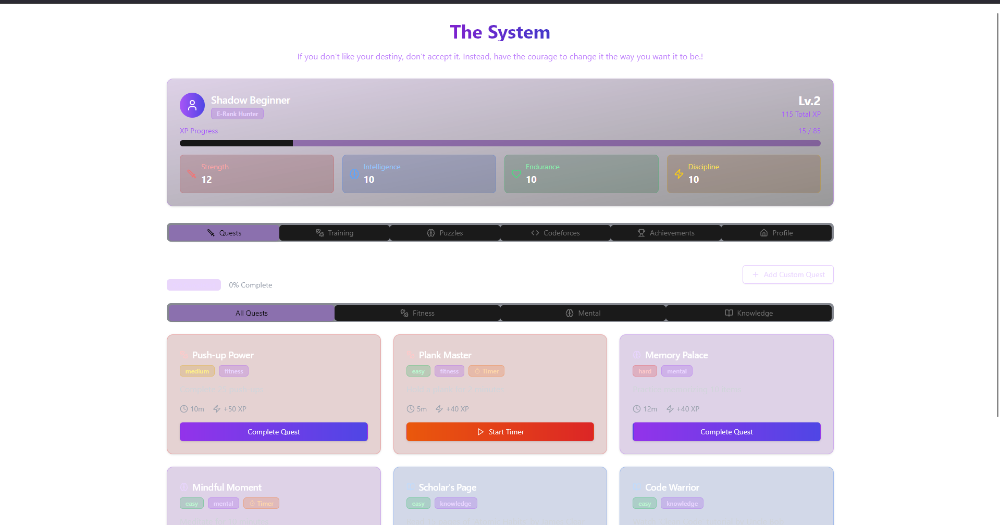
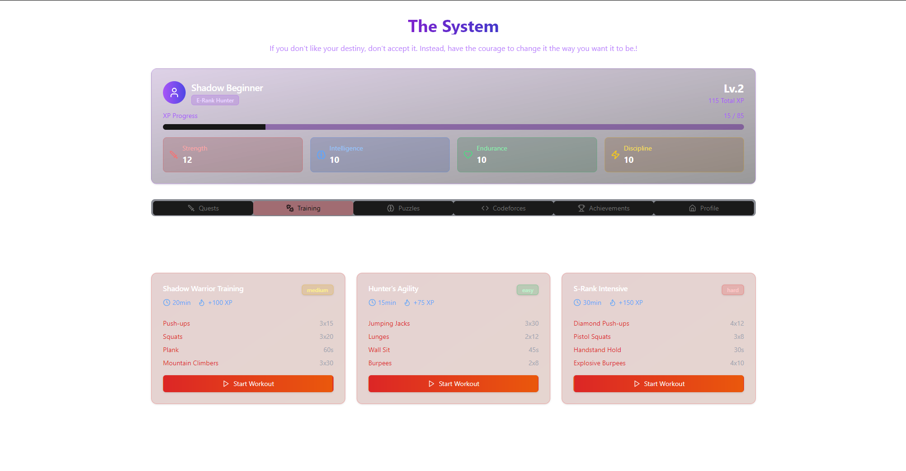
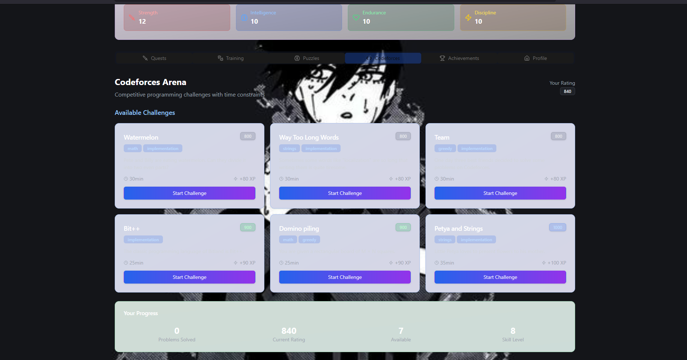
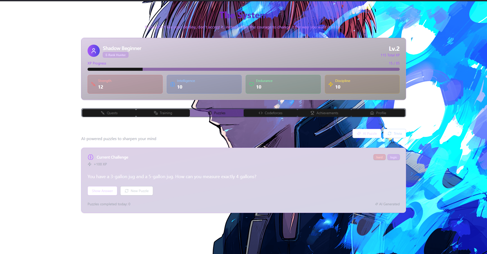

# 🗡️ Solo Leveling: Daily Progress Tracker

Inspired by the world of *Solo Leveling*, this web app helps you track your daily growth like a true Hunter! 💪📈

## 🚀 Project Overview

This app gamifies your daily routine. Whether it's workouts, brain training, or completing daily tasks, you level up your character as you level up in real life.

### 🌟 Features

- 🧠 **Brain Puzzles** – Sharpen your mind daily with new challenges.
- 🏋️ **Workout Mode** – Track and level up your strength training.
- 📅 **Daily Missions** – Get reminders for tasks, chores, or study goals.
- 🎮 **Level System** – XP, levels, and stats just like in *Solo Leveling*!
- 👫 **Social System** – Connect with friends, view their progress, and challenge them (coming soon!)

## 🖥️ Tech Stack

- **Frontend**: React + TypeScript + TailwindCSS
- **Bundler**: Vite
- **State Management**: (e.g., Zustand/Redux – if applicable)
- **Backend**: [Coming soon / FastAPI / Firebase / Supabase]
- **Auth**: [Coming soon / Auth0 / Firebase Auth]
- **Icons**: Lucide
- **UI Library**: shadcn/ui

## 📸 Screenshots

### 🧭 Dashboard


### 🏋️ Workout Tracker


### Problems Solving


### 🧠 Brain Puzzles



## 🛠️ Installation & Setup

Clone the repo:

```bash
git clone https://github.com/yourusername/solo-leveling-project.git
cd solo-leveling-project
npm install
npm run dev
